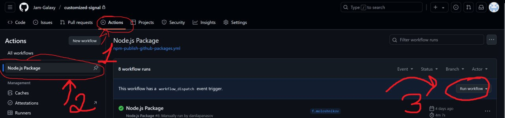

This is modified version of [Tone.js](https://github.com/Tonejs/Tone.js).
[Original README.md](docs/README.md)

Some differencies:
- fixed audio worklet loading error. (Original library does not allow loading more than one worklet)
- The build output is ESM modules instead of transpiled typescript modules, which are not the final assembly, and umd modules

## Setup
```npm install```
## Build
```npm run build```

After assembly, two folders are formed: ```dist``` and ```build```
The ```build``` folder is required for local development (see scenario 1 in the studio project). In this case, this is where the entry point is located.
The ```dist``` folder is a separate package that is ready to be published in Github Npm Packeges Registry and can replace the original project. It contains a lightweight package.json file and the build results.

It is planned that when pushing to the main branch of this repository, CI will execute the ```npm run build``` command and publish the updated package to the Github Npm Packages Registry. After that, this package can be updated inside the studio using npm.

## Publishing

- Manually increment the version inside package.json in the root of the project (trying to publish an existing version will result in an error, resulting in the package not being published).
- Call Github Actions to publish the package manually as shown in the screenshot.

## Usage
```
import Tone from "customized-tone";
```
or
```
import { Transport, Draw } from "customized-tone";
```